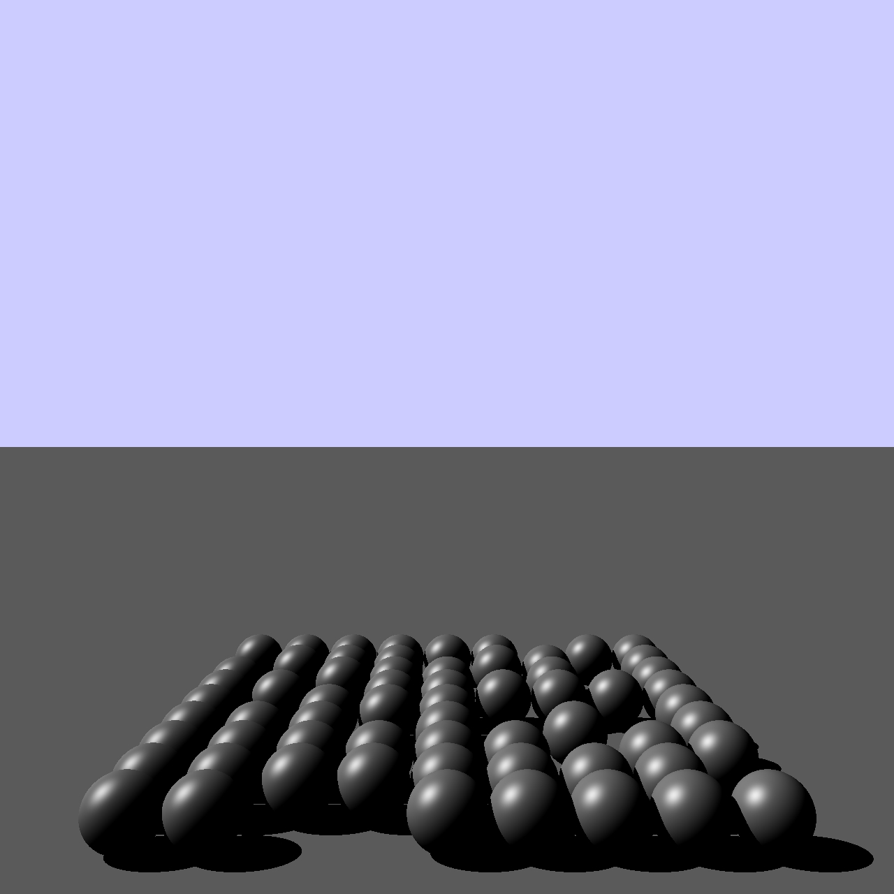

# korc - Kotlin Ray Caster

Raytracing engine written in Kotlin.

### Features:

- [x] Direct illumination
- [ ] Indirect illumination
- [x] Shadows
- [ ] Ambient occlusion
- [ ] Multisampling

#### Material interaction:
- [x] Diffuse reflection
- [x] Specular reflection
- [ ] Mirror reflection
- [ ] Refraction

#### Objects:
- [x] Planes
- [x] Spheres
- [ ] Triangle meshes

#### Lights:
- [x] Ambient
- [x] Direct
- [ ] Point
- [ ] Cone

